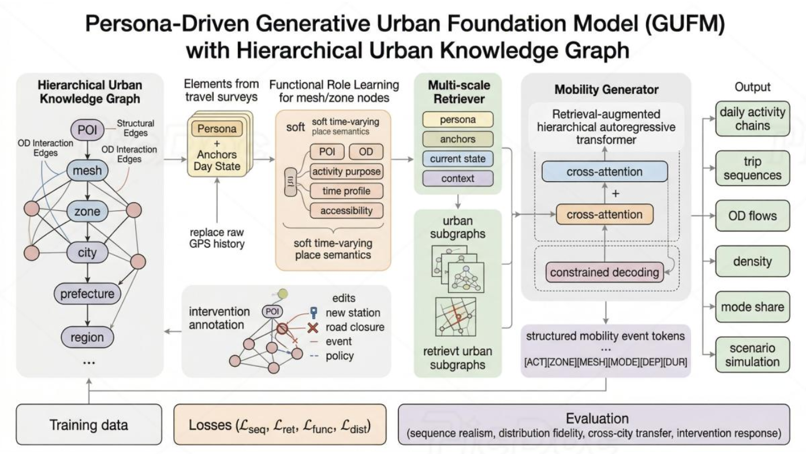

# GUFM 2026



This project explores how to convert a general urban knowledge graph
(UrbanKG) into structured **UrbanToken** representations that can be used as
inputs for Transformer-based urban foundation models.

The current workspace focuses on Tokyo 23 wards. It builds and uses an
UrbanKG containing urban entities such as `Ward`, `Area`, `Block`, `POI`,
`Road`, and `Cate`, together with relationships such as spatial containment,
area adjacency, POI categories, road membership, and ward-level OD flows.

The main research direction is:

```text
Urban data -> UrbanKG -> UrbanToken -> Transformer / GUFM
```
